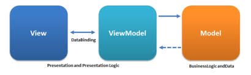

# RecipesApp
This is a recipe app where you can search for recipes.
## Dependencies
You need to install the following tools to run the project:
- [Xcode 13.0 or newer](https://developer.apple.com/download)
- 
## How to run
- ### Step 1 - Open the project in Xcode
You can open it using your terminal with this command `open RecipesApp.xcodeproj` or you can open it in your folder, where it was downloaded, with double click on `RecipesApp.xcodeproj`
- ### Step 2 -
After the installation, you can run the project in Xcode without any problem. Press the play button or press `cmd+R` in your keyboard.

### Architecture
This project uses Clean to do connections with API and use MVP with States and View Models to manage communication between Views and Controllers. For testing: project provides unit tests for each layer in the architecture.

### Third-party library
All dependencies are managed using Swift Package Manager.

- [Alamofire](https://github.com/Alamofire/Alamofire)

I chose it because it provides all the types of connections (GET, POST, etc) and it is easy to use to validate if the device has or not an internet connection

PD: I really enjoyed working on the test, I found it very interesting. The challenge was handling the API in the meal detail.
